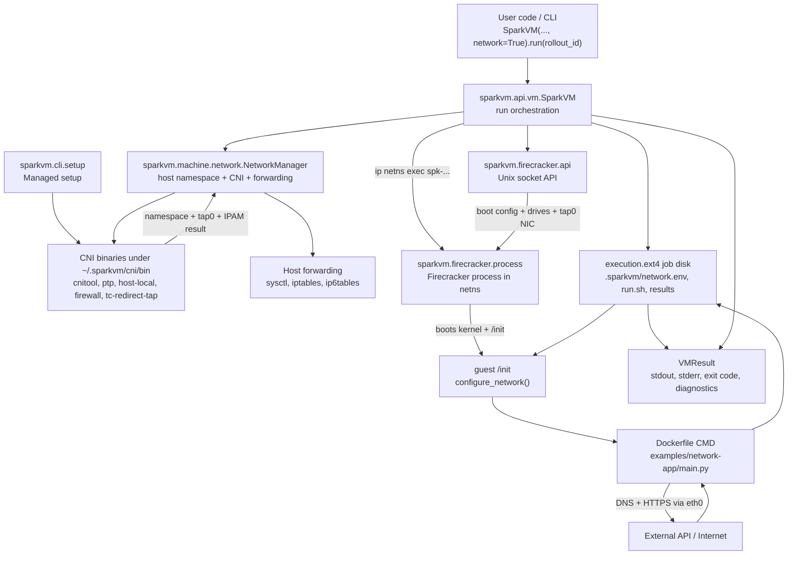
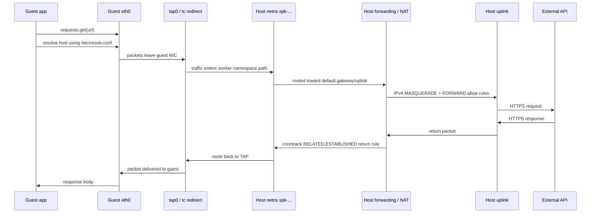

# SparkVM Network Flow

This document describes the complete `network=True` execution flow in SparkVM: how setup prepares host networking assets, how a VM run allocates a per-worker network, how Firecracker receives the TAP device, how the guest configures `eth0`, and how an app call leaves the microVM and returns.

## Current Network Shape

SparkVM uses CNI on the host to create an isolated Linux network namespace for each worker. The CNI plugin chain creates a point-to-point link, allocates guest IP data with `host-local`, applies CNI firewall behavior, and uses `tc-redirect-tap` so Firecracker can attach a TAP device named `tap0`.

When a VM boots, SparkVM injects the resolved network values into the job disk as `.sparkvm/network.env`. The guest `/init` reads that file, configures `eth0`, writes `/etc/resolv.conf`, runs network diagnostics, and then starts the rollout command from the Dockerfile.

The default example app in `examples/network-app/main.py` calls:

```text
https://api.github.com/repos/python/cpython
```

unless `NETWORK_APP_URL` is provided.

## High-Level Module Diagram



## Packet/Data Flow Diagram



## End-to-End Run Flow

1. The caller creates a rollout with `Rollouts().create(...)`. This is build-time only. It produces a Dockerfile-backed runtime image and does not allocate networking.
2. The caller creates `SparkVM(..., network=True, env={...})`.
3. `SparkVM.run(rollout.id)` creates a worker ID such as `worker-abc123...` and a worker directory under `~/.sparkvm/workers/<worker_id>`.
4. If networking is enabled, `SparkVM.run()` creates a `network_leases` row with status `created`.
5. `NetworkManager.setup(worker_id)` validates host privileges and CNI assets.
6. `NetworkManager.setup()` creates a Linux network namespace named `spk-<worker_id-derived-suffix>`.
7. `NetworkManager.setup()` runs `cnitool add <network_name> /var/run/netns/<namespace>`.
8. CNI allocates addresses and routes. SparkVM reads the CNI JSON result first, then falls back to inspecting the namespace with `ip -j addr` and `ip -j route` if needed.
9. SparkVM enables host forwarding and NAT for the allocated guest subnet.
10. SparkVM writes host diagnostics into the worker directory, including CNI output, namespace address data, route data, and firewall snapshots.
11. `SparkVM.run()` updates the lease status to `active` and injects `.sparkvm/network.env` into the execution disk.
12. SparkVM starts Firecracker inside the worker namespace with `ip netns exec <namespace> firecracker --api-sock ...`.
13. SparkVM configures Firecracker over its Unix socket: boot source, machine config, entropy, rootfs drive, job drive, and network interface.
14. Firecracker boots the guest. The guest `/init` mounts the job disk at `/job`.
15. Guest `/init` reads `/job/.sparkvm/network.env`, brings up `eth0`, assigns IP addresses, installs default routes, and writes `/etc/resolv.conf`.
16. Guest `/init` records network diagnostics to `/job/results/network.stdout.log` and `/job/results/network.stderr.log`.
17. Guest `/init` runs `/job/run.sh`, which executes the Dockerfile command.
18. The app performs its API call. In the network example, `main.py` calls the configured URL and prints the response body.
19. Guest `/init` writes phase logs and exit codes to `/job/results`.
20. Firecracker exits after guest shutdown. SparkVM reads results from `execution.ext4` and returns `VMResult`.
21. SparkVM runs CNI cleanup and deletes the namespace. The lease is marked `released`; cleanup failures mark it `failed`.

## Setup Module

Primary file: `src/sparkvm/cli/setup.py`

The setup layer prepares durable host-side assets under `SPARKVM_HOME`, normally `~/.sparkvm`.

Important functions:

- `get_sparkvm_paths()` resolves the managed directories, including `cni/bin`, `cni/conf`, `cni/ipam`, `images`, `workers`, and `bin`.
- `ensure_cni_layout()` creates CNI directories, writes the CNI conflist, and ensures required binaries are present.
- `sparkvm_cni_conflist()` renders the managed CNI network definition.
- `ensure_cni_binaries()` installs or verifies `cnitool`, `ptp`, `host-local`, `firewall`, and `tc-redirect-tap`.
- `run_setup()` ties together host validation, CNI layout, Firecracker installation, kernel image installation, database initialization, and default runtime setup.

The generated CNI conflist uses:

```text
ptp -> firewall -> tc-redirect-tap
```

The `ptp` plugin creates point-to-point networking and delegates IP allocation to `host-local`. The `firewall` plugin applies CNI firewall integration. The `tc-redirect-tap` plugin redirects traffic to a TAP interface that Firecracker can consume.

Default CNI values:

```text
network name: sparkvm
IPv4 subnet: 172.31.0.0/16
IPv4 route: 0.0.0.0/0
IPv6 route: ::/0
resolv.conf source: /run/systemd/resolve/resolv.conf if present, else /etc/resolv.conf
```

IPv6 can be enabled with `SPARKVM_CNI_ENABLE_IPV6=1` or explicitly configured with `SPARKVM_CNI_IPV6_SUBNET`.

## Run Orchestration Module

Primary file: `src/sparkvm/api/vm.py`

`SparkVM.run()` is the top-level execution coordinator. For networking, its main responsibilities are:

- Decide whether networking is enabled from the constructor value `network=True`.
- Create the worker directory and worker state.
- Create and update a `network_leases` database row.
- Call `NetworkManager.setup(vm_id)` before the execution disk is built.
- Persist network diagnostics returned by `NetworkManager`.
- Inject `.sparkvm/network.env` into `execution.ext4`.
- Start Firecracker inside the network namespace.
- Attach the TAP device to Firecracker through the Firecracker API.
- Clean up the CNI allocation after the run.

The execution disk injection happens in `_runtime_execution_files()`. When `network_config` exists, this file is added:

```text
.sparkvm/network.env
```

That file is generated by `render_network_env_file()` and contains values such as:

```text
SPARKVM_NET_ENABLED=1
SPARKVM_GUEST_IFACE=eth0
SPARKVM_GUEST_CIDR=172.31.x.y/16
SPARKVM_GATEWAY=172.31.x.1
SPARKVM_DNS=<resolver>
SPARKVM_NET_IP_SOURCE=stdout|netns
```

For Firecracker process placement, `SparkVM.run()` constructs:

```python
FirecrackerProcess(..., namespace_name=network_config.namespace_name)
```

That causes Firecracker itself to be launched with:

```text
ip netns exec <namespace> firecracker --api-sock <worker_dir>/firecracker.sock
```

Because Firecracker is running inside the worker namespace, `host_dev_name=tap0` resolves to the TAP device created for that namespace.

## Network Manager Module

Primary file: `src/sparkvm/machine/network.py`

`NetworkManager` is the central host-side networking implementation.

### Requirement Validation

`_validate_requirements()` checks:

- The process has network privileges through `has_network_privileges()`.
- The host has the `ip` command.
- `/dev/net/tun` exists.
- Required CNI binaries exist under `~/.sparkvm/cni/bin`.
- The CNI conflist exists under `~/.sparkvm/cni/conf`.

If privileges are missing, SparkVM raises a `NetworkSetupError` explaining that `CAP_NET_ADMIN` is required.

### Namespace and CNI Allocation

`setup(vm_id)` derives:

- Namespace name: `namespace_name_for(vm_id)`, for example `spk-workerabc123`.
- Namespace path: `/var/run/netns/<namespace>`.
- Guest MAC: `guest_mac(vm_id)`, a stable locally administered MAC based on SHA-256.

Then it runs:

```text
ip netns add <namespace>
cnitool add <network_name> /var/run/netns/<namespace>
```

The CNI environment includes:

```text
CNI_PATH=<home>/cni/bin
NETCONFPATH=<home>/cni/conf
CNI_ARGS=IgnoreUnknown=1;TC_REDIRECT_TAP_NAME=tap0
CNI_IFNAME=veth0
```

`TC_REDIRECT_TAP_NAME=tap0` is what makes the CNI chain create/use the TAP name expected by Firecracker.

### Address Resolution

After `cnitool add`, SparkVM tries to resolve guest network fields from CNI stdout:

- IPv4 CIDR
- IPv4 address
- IPv4 gateway
- Optional IPv6 CIDR
- Optional IPv6 address
- Optional IPv6 gateway
- DNS nameserver

If CNI stdout does not include usable IP data, SparkVM inspects the namespace:

```text
ip netns exec <namespace> ip -j -4 addr
ip netns exec <namespace> ip -j -6 addr
ip netns exec <namespace> ip -j route show default
ip netns exec <namespace> ip -j -6 route show default
```

The resulting `NetworkConfig.ip_source` is either `stdout` or `netns`.

### DNS Selection

DNS is chosen in this order:

1. A usable IPv4 nameserver from CNI result JSON.
2. First usable host resolver from `/run/systemd/resolve/resolv.conf`.
3. First usable host resolver from `/etc/resolv.conf`.
4. Fallback `1.1.1.1`.

Loopback resolvers and non-IPv4 nameservers are ignored for guest DNS because the guest cannot use host-local resolver addresses such as `127.0.0.53`.

### Host Forwarding and NAT

`_ensure_host_forwarding()` makes egress work after CNI allocation.

For IPv4, SparkVM:

- Resolves the host default egress interface with `ip -j route show default`.
- Enables `net.ipv4.ip_forward=1`.
- Removes older un-commented legacy SparkVM forwarding rules for the guest subnet.
- Ensures `iptables` `POSTROUTING` MASQUERADE for traffic leaving the guest subnet.
- Ensures `FORWARD` allow rules for egress and return traffic.
- Adds TCPMSS clamp rules in the `mangle` table for outbound and return TCP SYN packets.
- Records matching firewall rules into `network-host-forwarding.log`.

For IPv6, SparkVM performs similar work with `ip6tables` when the guest has an IPv6 CIDR and the host has an IPv6 default route. If IPv6 forwarding cannot be prepared, SparkVM logs that IPv6 forwarding was skipped unless `SPARKVM_REQUIRE_IPV6_FORWARDING=1` is set.

### Diagnostics

`NetworkDiagnostics` captures:

```text
network-add.stdout.json
network-add.stderr.log
network-netns-addr.json
network-netns-route.json
network-host-forwarding.log
network-del.stdout.log
network-del.stderr.log
```

These are persisted under the worker directory when available. They are especially important because network failures can happen before the guest boots.

### Cleanup

After the run, `NetworkManager.cleanup(config)` executes:

```text
cnitool del <network_name> /var/run/netns/<namespace>
ip netns del <namespace>
```

Missing-resource errors are tolerated during cleanup because a partially failed setup can leave only some resources behind. Stale namespace cleanup is also supported through `cleanup_stale()`, which uses `network_leases` when available and otherwise scans namespaces beginning with `spk-`.

## Firecracker Process and API Modules

Primary files:

- `src/sparkvm/firecracker/process.py`
- `src/sparkvm/firecracker/api.py`

`FirecrackerProcess` starts the Firecracker daemon. If a namespace name is provided, `_build_command()` prefixes the command with:

```text
ip netns exec <namespace>
```

`FirecrackerAPIClient` configures Firecracker through its Unix socket. Network attachment is done with:

```python
api.attach_network(
    iface_id="eth0",
    host_dev_name="tap0",
    guest_mac="<stable generated MAC>",
)
```

This sends:

```text
PUT /network-interfaces/eth0
```

with:

```json
{
  "iface_id": "eth0",
  "host_dev_name": "tap0",
  "guest_mac": "02:fc:..."
}
```

After rootfs, job disk, entropy, and network are configured, SparkVM starts the VM with:

```text
PUT /actions {"action_type": "InstanceStart"}
```

## Guest Init Module

Primary source: `SPARKVM_INIT_TEMPLATE` in `src/sparkvm/core/constants.py`

The guest `/init` script is injected into runtime images during image preparation. Its network responsibilities are inside `configure_network()` and `collect_network_diagnostics()`.

During boot:

1. `/init` mounts `/dev/vdb` at `/job`.
2. `/init` sources `/job/.sparkvm/runtime.env` and optional `/job/.sparkvm/env.sh`.
3. `/init` checks for `/job/.sparkvm/network.env`.
4. If networking is enabled, `/init` brings up loopback and `eth0`.
5. It disables IPv6 DAD delay where possible.
6. It flushes existing addresses on `eth0`.
7. It assigns `SPARKVM_GUEST_CIDR` to `eth0`.
8. It replaces the IPv4 default route through `SPARKVM_GATEWAY` when present.
9. It assigns `SPARKVM_GUEST_IPV6_CIDR` and IPv6 default route when present.
10. It writes `/etc/resolv.conf` with `SPARKVM_DNS` and bounded resolver timeout options.

The generated resolver file looks like:

```text
nameserver <SPARKVM_DNS>
options timeout:2 attempts:2
```

`collect_network_diagnostics()` writes guest-side network facts into:

```text
/job/results/network.stdout.log
/job/results/network.stderr.log
```

It captures:

- `ip addr`
- `ip route`
- `ip -6 route`
- `/etc/resolv.conf`
- route checks to gateway and DNS
- ping checks when `ping` exists
- a bounded `getent hosts api.github.com` DNS probe when `getent` and `timeout` exist

If `configure_network()` fails, `/init` writes final exit code `125` and shuts down before running user code.

## Example Network App Flow

Primary files:

- `examples/network-app/run_example.py`
- `examples/network-app/Dockerfile`
- `examples/network-app/main.py`

`run_example.py` creates a Dockerfile-backed rollout and runs it with:

```python
SparkVM(
    vcpu=1,
    memory="512M",
    disk="2G",
    timeout=120.0,
    network=True,
    env={},
)
```

The Dockerfile installs `requests`, copies `examples/network-app` into `/workspace`, and runs:

```text
python -u main.py
```

`main.py`:

1. Reads `NETWORK_APP_URL`, defaulting to GitHub's CPython repo API.
2. Reads `NETWORK_APP_TIMEOUT`, defaulting to `30.0`.
3. Calls `requests.get(url, timeout=timeout)`.
4. Raises on non-2xx/3xx HTTP status.
5. Prints JSON response bodies with indentation, or raw text for non-JSON responses.

This means the application-level data path is now intentionally simple:

```text
main.py -> requests -> guest DNS/TCP/TLS -> SparkVM network path -> external API -> stdout
```

The diagnostic logs still exist at the platform layer, but the example app itself prints only the API response.

## Worker Artifacts

For a networked worker, useful files under `~/.sparkvm/workers/<worker_id>` include:

```text
worker.json
firecracker.log
execution.ext4
network-result.json
network-add.stdout.json
network-add.stderr.log
network-netns-addr.json
network-netns-route.json
network-host-forwarding.log
network-del.stdout.log
network-del.stderr.log
result.json or failure.json
```

Inside `execution.ext4`, guest results are written under:

```text
/results/network.stdout.log
/results/network.stderr.log
/results/run.stdout.log
/results/run.stderr.log
/results/run.exit_code
/results/final_exit_code
```

`VMResult.stdout` is read from the guest run logs, so for the simple network app it contains the printed API response.

## Failure Boundaries

Network failures are split into host-side and guest-side phases.

Host-side setup failures happen before Firecracker starts. Common causes:

- Missing `CAP_NET_ADMIN`.
- Missing `/dev/net/tun`.
- Missing CNI binaries.
- Missing CNI conflist.
- `cnitool add` failure.
- Could not resolve guest IPv4 from CNI output or namespace inspection.
- Host forwarding or NAT command failure.

Guest-side failures happen after Firecracker boots. Common causes:

- Runtime image does not contain `ip`.
- Guest cannot assign the provided CIDR.
- Guest cannot install the default route.
- Guest DNS resolver is unreachable.
- Application timeout or TLS/connectivity failure.

Cleanup failures are handled separately. SparkVM attempts CNI delete and namespace delete; if cleanup fails after an otherwise failed run, the original failure remains primary and the cleanup error is appended to preserved failure metadata.

## Environment Knobs

Host/setup network knobs:

```text
SPARKVM_CNI_NETWORK_NAME
SPARKVM_CNI_SUBNET
SPARKVM_CNI_DEFAULT_ROUTE
SPARKVM_CNI_ENABLE_IPV6
SPARKVM_CNI_IPV6_SUBNET
SPARKVM_CNI_IPV6_DEFAULT_ROUTE
SPARKVM_CNI_RESOLV_CONF
SPARKVM_CNI_PLUGINS_VERSION
SPARKVM_CNITOOL_VERSION
SPARKVM_TC_REDIRECT_TAP_VERSION
SPARKVM_REQUIRE_IPV6_FORWARDING
```

Example app knobs:

```text
NETWORK_APP_URL
NETWORK_APP_TIMEOUT
```

Guest runtime values injected by SparkVM:

```text
SPARKVM_NET_ENABLED
SPARKVM_GUEST_IFACE
SPARKVM_GUEST_CIDR
SPARKVM_GUEST_IP
SPARKVM_GUEST_IPV6_CIDR
SPARKVM_GUEST_IPV6
SPARKVM_GATEWAY
SPARKVM_GATEWAY_IPV6
SPARKVM_DNS
SPARKVM_NET_IP_SOURCE
```

## Mental Model

The simplest way to reason about SparkVM networking is:

```text
SparkVM host setup owns durable CNI assets.
Each VM run owns one short-lived namespace and TAP.
Firecracker runs inside that namespace and receives tap0.
The guest receives only eth0 plus a network.env file.
The app just uses normal Linux networking.
Cleanup tears down the CNI allocation and namespace.
```
