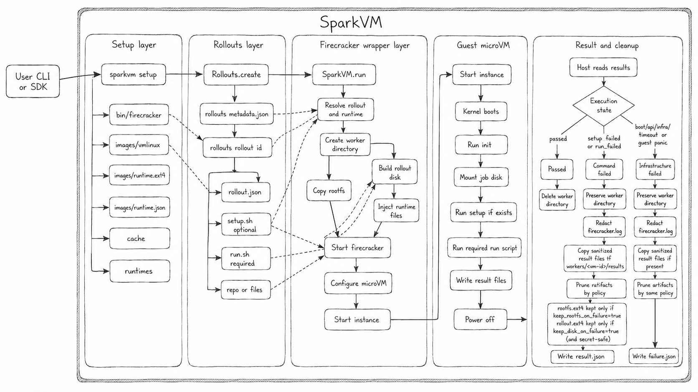

# SparkVM

SparkVM is a Firecracker wrapper that talks directly to the Firecracker API to initialize and manage microVMs for agent execution.

It provides a complete single-agent rollout lifecycle: isolated playgrounds, network restrictions, memory snapshot checkpoints, and fast restore so agents can resume exactly where they left off.

it is inspired by composer-2 technical report this is where it all started: 
[composer-2 article on X](https://x.com/jaga_prasanna/status/2054872261166080226?s=20)


## Cli usage 

`sparkvm setup` it creates SparkVM directories under `~/.sparkvm`. firecracker bin at `~/.sparkvm/bin/firecracker`.kernel image at `~/.sparkvm/images/vmlinux`.

```bash
sparkvm cleanup all | rollouts | workers 
# Cleanup rollouts and/or preserved failed worker folders

sparkvm reset 
# delete all files under ~/.sparkvm 

sparkvm workers list | view | delete 
# Inspect and manage preserved failed worker attempts

sparkvm recycle 
# re-execute the failed rollouts 

```
 

## root folder design 

```text
~/.sparkvm/
├── bin/
│   └── firecracker
├── images/
│   ├── vmlinux
│   ├── python-3.12-slim.ext4
│   ├── python-3.12-slim.json
│   ├── ubuntu-24.04.ext4
│   └── ubuntu-24.04.json
├── rollouts/
│   ├── metadata.json
│   └── rollout-*/
├── workers/
└── cache/
```

## High level design 

```mermaid
 flowchart LR
    U["User CLI or SDK"]

    subgraph SPARK["SparkVM"]
        direction LR

        subgraph SETUP["Setup layer"]
            direction TB
            SETUP_CMD["sparkvm setup"]
            BIN["bin/firecracker"]
            KERNEL["images/vmlinux"]
            ROOTFS_IMG["images/runtime.ext4"]
            RUNTIME_JSON["images/runtime.json"]
            CACHE["cache"]
            RUNTIMES["runtimes"]

            SETUP_CMD --> BIN
            SETUP_CMD --> KERNEL
            SETUP_CMD --> ROOTFS_IMG
            SETUP_CMD --> RUNTIME_JSON
            SETUP_CMD --> CACHE
            SETUP_CMD --> RUNTIMES
        end

        subgraph ROLLOUTS["Rollouts layer"]
            direction TB
            CREATE["Rollouts.create"]
            R_META["rollouts metadata.json"]
            R_DIR["rollouts rollout id"]
            R_JSON["rollout.json"]
            SETUP_SH["setup.sh optional"]
            RUN_SH["run.sh required"]
            SOURCE["repo or files"]

            CREATE --> R_META
            CREATE --> R_DIR
            R_DIR --> R_JSON
            R_DIR --> SETUP_SH
            R_DIR --> RUN_SH
            R_DIR --> SOURCE
        end

        subgraph WRAPPER["Firecracker wrapper layer"]
            direction TB
            RUN["SparkVM.run"]
            RESOLVE["Resolve rollout and runtime"]
            WORKER["Create worker directory"]
            ROOTFS["Copy rootfs"]
            JOBDISK["Build rollout disk"]
            INJECT["Inject runtime files"]
            FC["Start firecracker"]
            API["Configure microVM"]
            START["Start instance"]

            RUN --> RESOLVE
            RESOLVE --> WORKER
            WORKER --> ROOTFS
            WORKER --> JOBDISK
            JOBDISK --> INJECT
            ROOTFS --> FC
            INJECT --> FC
            FC --> API
            API --> START
        end

        subgraph VM["Guest microVM"]
            direction TB
            BOOT["Kernel boots"]
            INIT["Run init"]
            MOUNT["Mount job disk"]
            SETUP_RUN["Run setup if exists"]
            MAIN_RUN["Run required run script"]
            WRITE["Write result files"]
            SHUTDOWN["Power off"]

            START --> BOOT
            BOOT --> INIT
            INIT --> MOUNT
            MOUNT --> SETUP_RUN
            SETUP_RUN --> MAIN_RUN
            MAIN_RUN --> WRITE
            WRITE --> SHUTDOWN
        end

        subgraph CLEANUP["Result and cleanup"]
            direction TB
            READ["Host reads results"]
            STATE{"Execution state"}
            PASS["Passed"]
            CMD_FAIL["Command failed or phase timeout"]
            INFRA_FAIL["Infrastructure failed"]
            DELETE1["Delete worker directory"]
            PRESERVE_RESULT["Preserve worker and write result.json"]
            PRESERVE["Preserve worker directory"]
            FAILURE["Redact logs and write failure.json"]

            SHUTDOWN --> READ
            READ --> STATE
            STATE -->|passed| PASS
            STATE -->|setup run setup_timeout run_timeout| CMD_FAIL
            STATE -->|boot api timeout infra| INFRA_FAIL
            PASS --> DELETE1
            CMD_FAIL --> PRESERVE_RESULT
            INFRA_FAIL --> PRESERVE
            PRESERVE --> FAILURE
        end

        BIN -.-> FC
        KERNEL -.-> RESOLVE
        ROOTFS_IMG -.-> RESOLVE
        R_META -.-> RESOLVE
        SOURCE -.-> JOBDISK
        RUN_SH -.-> JOBDISK
        SETUP_SH -.-> JOBDISK
    end

    U --> SETUP_CMD
    U --> CREATE
    U --> RUN

```






## Python usage

```python
from sparkvm import SparkVM, Rollouts

rollouts = Rollouts()
rollout = rollouts.create(
    name="hello",
    mode="script",
    runtime="python-3.12-slim",
    files={"main.py": "print('hello')"},
    run_cmd="python3 /job/main.py",
)

result = SparkVM(runtime="python-3.12-slim").run(rollout.id)
print(result.exit_code, result.stdout)
```

Runtime env + networking:

```python
import os
from sparkvm import SparkVM

vm = SparkVM(
    runtime="python-3.12-slim",
    vcpu=2,
    memory="2G",
    timeout=300,
    network=True,
    env={"OPENAI_API_KEY": os.environ["OPENAI_API_KEY"]},
    keep_rootfs_on_failure=False,
    keep_disk_on_failure=False,
)
```

`env` values are runtime-scoped: SparkVM writes them only to the temporary execution disk for the active run, scrubs them from preserved worker artifacts, and never stores raw values in rollout/result metadata. True in-memory secret delivery requires a future vsock guest-agent path.

SparkVM also injects non-secret runtime config into `/job/.sparkvm/runtime.env`:
- `SPARKVM_SETUP_TIMEOUT_SEC=300`
- `SPARKVM_RUN_TIMEOUT_SEC=300`

Guest `/init` enforces per-phase timeouts with `timeout` (when available). Exit code `124` maps to `setup_timeout` or `run_timeout`.

Failure preservation defaults are metadata-first and disk-lightweight: SparkVM preserves `firecracker.log`, worker metadata (`result.json` / `failure.json`), and sanitized `results/`, while deleting per-run `rootfs.ext4` and `rollout.ext4` unless explicitly enabled with `keep_rootfs_on_failure=True` and/or `keep_disk_on_failure=True`.

Recommended setup preflight commands for network-heavy installs:

```bash
ip addr || true
ip route || true
cat /etc/resolv.conf || true
getent hosts pypi.org || true
curl -Iv --max-time 10 https://pypi.org/simple/ || true
```

Custom Ubuntu runtime:

```python
rollout = rollouts.create(
    name="shell",
    mode="script",
    runtime="ubuntu-24.04",
    files={"hello.sh": "echo hello"},
    run_cmd="sh /job/hello.sh",
)

result = SparkVM(runtime="ubuntu-24.04").run(rollout.id)
```     

Dockerfile-first repo rollout:

```python
rollout = rollouts.create(
    name="version-3",
    mode="repo",
    source=REPO_URL,
    ref="main",
    dockerfile="Dockerfile",
)
```

For this phase, repo rollouts are Dockerfile-only. The Dockerfile is the build/setup contract: it must install dependencies, copy the app into the image, and define `CMD`/`ENTRYPOINT` unless you pass `run_cmd`.

Recommended Dockerfile pattern:

```dockerfile
FROM python:3.12-slim
WORKDIR /workspace
COPY requirements.txt .
RUN pip install -r requirements.txt
COPY . .
CMD ["pytest", "-q"]
```

Override the Docker command when needed:

```python
rollout = rollouts.create(
    name="version-3-test",
    mode="repo",
    source=REPO_URL,
    dockerfile="Dockerfile",
    run_cmd="pytest tests/test_api.py -q",
)
```

Notes:
- Dependency installation belongs in the Dockerfile.
- `run_cmd` is an execution override.
- `image=` is not supported yet. Provide `dockerfile="Dockerfile"` instead.
- `setup_cmd` is not supported in Dockerfile-only mode.
- `SparkVM.run()` is execution-only: it boots the prepared ext4 image, attaches the job disk, and runs `/job/run.sh`; it does not call Docker or install dependencies.


## Download Firecracker binary

install using this 

```bash
cd ~/coding/coderoll

ARCH="$(uname -m)"
release_url="https://github.com/firecracker-microvm/firecracker/releases"
latest=$(basename "$(curl -fsSLI -o /dev/null -w '%{url_effective}' ${release_url}/latest)")

curl -L "${release_url}/download/${latest}/firecracker-${latest}-${ARCH}.tgz" | tar -xz

mv "release-${latest}-${ARCH}/firecracker-${latest}-${ARCH}" firecracker
chmod +x firecracker

sudo mv firecracker /usr/local/bin/firecracker

```

make sure you check 

```bash
firecracker --version

ls -l /dev/kvm # firecracker needs KVM so 

```


## Kernel workflow


This is kernel level code which runs the firecracker VM process 

```text
Host:
  creates workers/<vm-id>/rootfs.ext4 as a writable copy of images/image-<rollout-id>.ext4 for Dockerfile repo rollouts
  creates rollout.ext4
  copies rollout run.sh
  writes .sparkvm/env.sh if env provided
  writes .sparkvm/redact.sed if env provided and redaction rules are available
  writes .sparkvm/network.env if network enabled
  attaches rootfs as /dev/vda
  attaches rollout disk as /dev/vdb
  starts VM

Guest /init:
  mounts proc/sys/dev
  mounts tmpfs dirs
  mounts /dev/vdb -> /job
  configures network
  sources env
  runs setup.sh only when SPARKVM_RUN_SETUP_IN_GUEST=1
  runs run.sh
  writes results
  powers off

Host:
  mounts rollout.ext4
  reads results
  returns VMResult
  never copies results back into rollouts/<rollout-id>/
  deletes worker on normal completion


```
