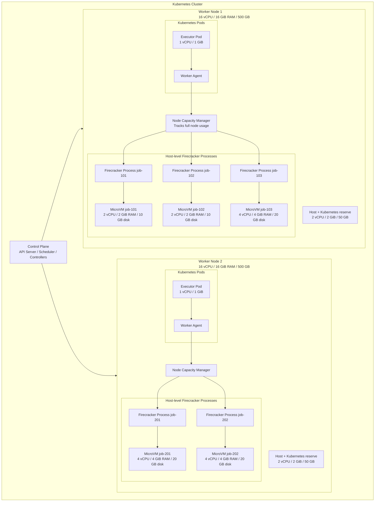
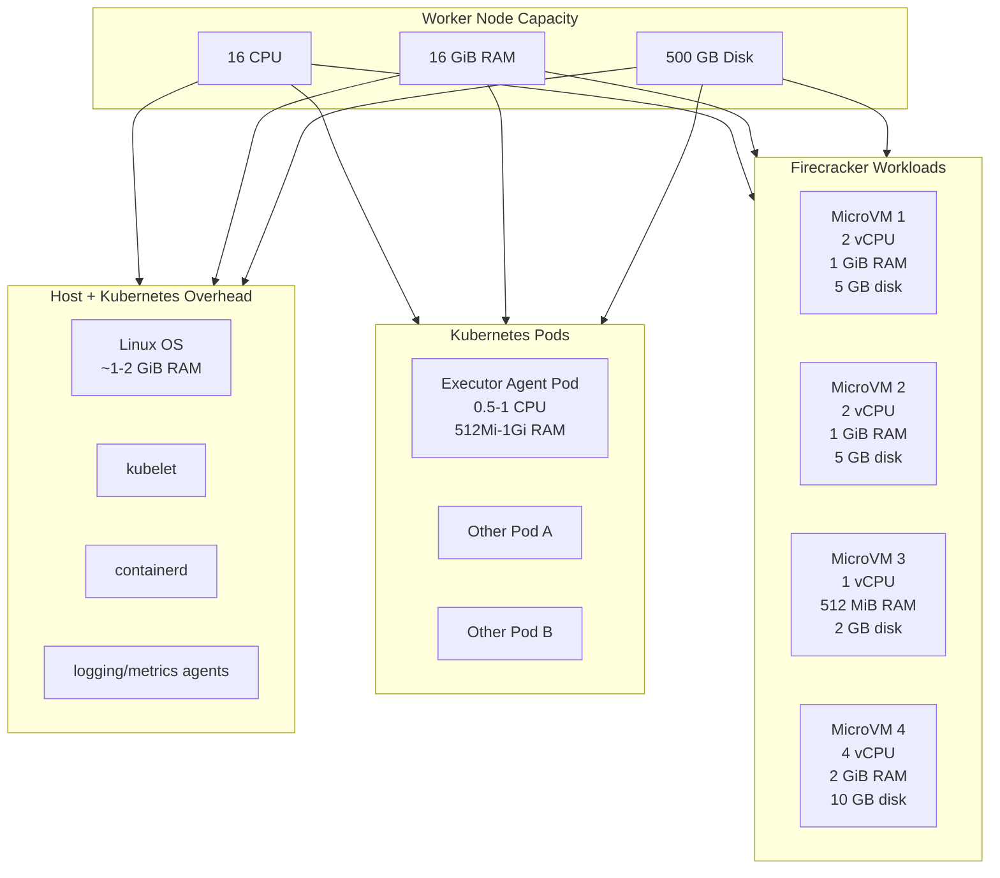
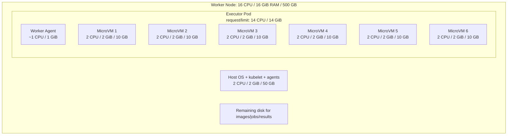

## CASE B 

```mermaid
flowchart TD
    subgraph Cluster["Kubernetes Cluster"]
        CP["Control Plane<br/>API Server / Scheduler / Controllers"]

        subgraph Node1["Worker Node 1<br/>16 vCPU / 16 GiB RAM / 500 GB"]
            N1Reserve["Host + Kubernetes reserve<br/>2 vCPU / 2 GiB / 50 GB"]

            subgraph N1Pods["Kubernetes Pods"]
                N1ExecutorPod["Executor Pod<br/>1 vCPU / 1 GiB"]
                N1Agent["Worker Agent"]
                N1ExecutorPod --> N1Agent
            end

            N1Capacity["Node Capacity Manager<br/>Tracks full node usage"]

            subgraph N1HostFirecracker["Host-level Firecracker Processes"]
                N1FC1["Firecracker Process job-101"]
                N1FC2["Firecracker Process job-102"]
                N1FC3["Firecracker Process job-103"]

                N1VM1["MicroVM job-101<br/>2 vCPU / 2 GiB RAM / 10 GB disk"]
                N1VM2["MicroVM job-102<br/>2 vCPU / 2 GiB RAM / 10 GB disk"]
                N1VM3["MicroVM job-103<br/>4 vCPU / 4 GiB RAM / 20 GB disk"]

                N1FC1 --> N1VM1
                N1FC2 --> N1VM2
                N1FC3 --> N1VM3
            end

            N1Agent --> N1Capacity
            N1Capacity --> N1FC1
            N1Capacity --> N1FC2
            N1Capacity --> N1FC3
        end

        subgraph Node2["Worker Node 2<br/>16 vCPU / 16 GiB RAM / 500 GB"]
            N2Reserve["Host + Kubernetes reserve<br/>2 vCPU / 2 GiB / 50 GB"]

            subgraph N2Pods["Kubernetes Pods"]
                N2ExecutorPod["Executor Pod<br/>1 vCPU / 1 GiB"]
                N2Agent["Worker Agent"]
                N2ExecutorPod --> N2Agent
            end

            N2Capacity["Node Capacity Manager"]

            subgraph N2HostFirecracker["Host-level Firecracker Processes"]
                N2FC1["Firecracker Process job-201"]
                N2FC2["Firecracker Process job-202"]

                N2VM1["MicroVM job-201<br/>4 vCPU / 4 GiB RAM / 20 GB disk"]
                N2VM2["MicroVM job-202<br/>4 vCPU / 4 GiB RAM / 20 GB disk"]

                N2FC1 --> N2VM1
                N2FC2 --> N2VM2
            end

            N2Agent --> N2Capacity
            N2Capacity --> N2FC1
            N2Capacity --> N2FC2
        end
    end

    CP --> Node1
    CP --> Node2

```

## worker node level allocation

```mermaid
flowchart TD
    subgraph Node["Worker Node Capacity"]
        TotalCPU["16 CPU"]
        TotalRAM["16 GiB RAM"]
        TotalDisk["500 GB Disk"]
    end

    subgraph HostOverhead["Host + Kubernetes Overhead"]
        OS["Linux OS<br/>~1-2 GiB RAM"]
        Kubelet["kubelet"]
        ContainerRuntime["containerd"]
        Monitoring["logging/metrics agents"]
    end

    subgraph Pods["Kubernetes Pods"]
        ExecutorPod["Executor Agent Pod<br/>0.5-1 CPU<br/>512Mi-1Gi RAM"]
        APod["Other Pod A"]
        BPod["Other Pod B"]
    end

    subgraph FirecrackerLayer["Firecracker Workloads"]
        VM1["MicroVM 1<br/>2 vCPU<br/>1 GiB RAM<br/>5 GB disk"]
        VM2["MicroVM 2<br/>2 vCPU<br/>1 GiB RAM<br/>5 GB disk"]
        VM3["MicroVM 3<br/>1 vCPU<br/>512 MiB RAM<br/>2 GB disk"]
        VM4["MicroVM 4<br/>4 vCPU<br/>2 GiB RAM<br/>10 GB disk"]
    end

    TotalCPU --> HostOverhead
    TotalRAM --> HostOverhead
    TotalDisk --> HostOverhead

    TotalCPU --> Pods
    TotalRAM --> Pods
    TotalDisk --> Pods

    TotalCPU --> FirecrackerLayer
    TotalRAM --> FirecrackerLayer
    TotalDisk --> FirecrackerLayer

```

## Architecture

```mermaid

flowchart TD
    subgraph Node["Worker Node: 16 CPU / 16 GiB RAM / 500 GB"]
        Host["Host OS + kubelet + agents<br/>2 CPU / 2 GiB / 50 GB"]

        subgraph ExecutorPod["Executor Pod<br/>request/limit: 14 CPU / 14 GiB"]
            Agent["Worker Agent<br/>~1 CPU / 1 GiB"]
            VM1["MicroVM 1<br/>2 CPU / 2 GiB / 10 GB"]
            VM2["MicroVM 2<br/>2 CPU / 2 GiB / 10 GB"]
            VM3["MicroVM 3<br/>2 CPU / 2 GiB / 10 GB"]
            VM4["MicroVM 4<br/>2 CPU / 2 GiB / 10 GB"]
            VM5["MicroVM 5<br/>2 CPU / 2 GiB / 10 GB"]
            VM6["MicroVM 6<br/>2 CPU / 2 GiB / 10 GB"]
        end

        Disk["Remaining disk for images/jobs/results"]
    end
```
